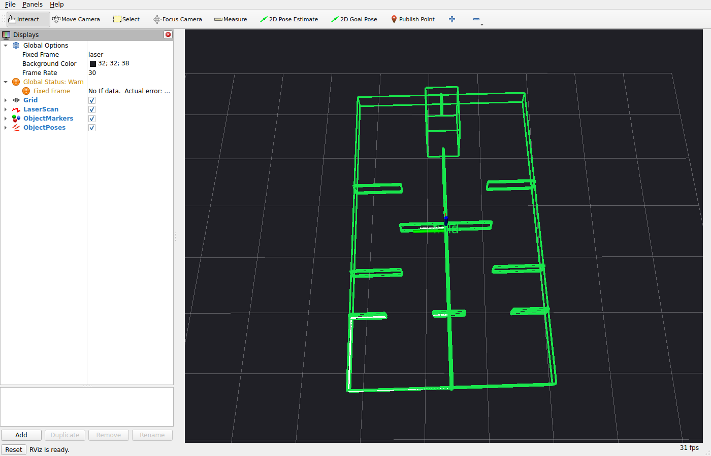

# sotoba_ros

[sotoba](https://github.com/Stew-000-1-0-011/sotoba) の点対面ICPを使い、
`/scan` (`sensor_msgs/msg/LaserScan`) から既知オブジェクト群の
**LiDAR座標系での姿勢**を推定して `Pose` を publish する ROS 2 パッケージ。

対応環境: ROS 2 Lyrical Luth / Ubuntu 26.04。
sotoba が deducing this (P0847) と多次元 `operator[]` (P2128) を使うため C++23 必須
(GCC 14+ / Clang 18+)。

## 構成

| ファイル | 役割 |
| --- | --- |
| `include/sotoba_ros/objects.hpp` | オブジェクトの型 (`Surface`, `ObjectDef`) と `make_objects()` の宣言 |
| `src/objects.cpp` | **オブジェクトの実体。ここを書き換えて使う** (現在は千葉大ロボコン2026フィールド) |
| `include/sotoba_ros/icp_engine.hpp` | ICPラッパのインタフェース。sotobaのICPヘッダは出てこない (pimpl) |
| `src/icp_engine.cpp` | sotobaのICPテンプレートを実体化する唯一のTU |
| `include/sotoba_ros/markers.hpp` | 形状を RViz2 の Marker にする関数の宣言 |
| `src/markers.cpp` | 形状 -> MarkerArray の変換 (ICPとは独立の別TU) |
| `include/sotoba_ros/sotoba_node.hpp` | ノード `SotobaNode` の宣言。オブジェクト群はコンストラクタで受け取る |
| `src/sotoba_node_impl.cpp` | ノードの実装 (ROSの入出力とパラメータ) |
| `src/sotoba_node.cpp` | `main()`。`make_objects()` の結果をノードへ渡す |
| `test/icp_smoke_test.cpp` | 合成スキャンでICPの収束を確認するスモークテスト (ROS不要) |
| `test/fake_scan_publisher.cpp` | `objects.cpp` の形状から合成 `/scan` と真値姿勢を流すノード |
| `test/check_poses.py` | 真値と推定を突き合わせる手動テスト |

### コンパイルの分割

重いのは sotoba の ICP テンプレート (曲面の型リストで実体化される) なので、
その実体化を `src/icp_engine.cpp` の1TUに閉じ込めている。
`icp_engine.hpp` は `sotoba/icp_resource/*` をインクルードしない。

結果として、

- 形状を変えた → 再コンパイルは `objects.cpp` だけ
- ノードのROS周りを変えた → 再コンパイルは `sotoba_node_impl.cpp` だけ
- `objects.hpp` の `Surface` に曲面を足した → ICPの実体化 (`icp_engine.cpp`) が再コンパイル

という切り分けになる。

## ビルド

sotoba は rosdep に無いので、先に install しておく。

```bash
git clone https://github.com/Stew-000-1-0-011/sotoba.git
cmake -S sotoba -B sotoba/build -DCMAKE_BUILD_TYPE=Release \
  -DCMAKE_INSTALL_PREFIX=$HOME/.local -DBUILD_DEVS=OFF \
  -DBUILD_STATIC_LIB=OFF -DBUILD_SHARED_LIB=OFF -DBUILD_MODULE_LIB=OFF
cmake --build sotoba/build --target install
```

その上でワークスペースをビルドする。

```bash
colcon build --packages-select sotoba_ros \
  --cmake-args -DCMAKE_BUILD_TYPE=Release -DCMAKE_PREFIX_PATH=$HOME/.local
```

sotoba を自前で install したくなければ、CMake側で取ってこさせてもよい。

```bash
colcon build --packages-select sotoba_ros \
  --cmake-args -DCMAKE_BUILD_TYPE=Release -DSOTOBA_ROS_FETCH_SOTOBA=ON
```

## 実行

```bash
ros2 launch sotoba_ros sotoba_node.launch.py
# or
ros2 run sotoba_ros sotoba_node --ros-args --params-file config/sotoba_node.yaml
```

### トピック

| 方向 | トピック | 型 |
| --- | --- | --- |
| sub | `scan_topic` パラメータ (既定 `/scan`) | `sensor_msgs/msg/LaserScan` |
| pub | `~/objects/<name>/pose` | `geometry_msgs/msg/PoseStamped` |
| pub | `~/object_poses` | `geometry_msgs/msg/PoseArray` |
| pub | `~/object_markers` | `visualization_msgs/msg/MarkerArray` (RViz2用、transient local) |

publish される姿勢は「オブジェクトローカル座標系をLiDAR座標系へ写す SE3」、
すなわち **LiDARから見たオブジェクトの位置姿勢**。
`frame_id` と `stamp` は入力 `LaserScan` のものをそのまま使う。

更新に失敗したオブジェクト (対応点不足・解けなかった) は publish されず、警告が出る。

## テスト

ROSに依存しないスモークテストを1つ入れてある
(`test/icp_smoke_test.cpp`)。`objects.cpp` のオブジェクトを真値の姿勢に置き、
2D LiDAR を模したレイキャストで合成スキャンを作り、初期姿勢をシードにしたICPが
真値へ戻るかを見る。

```bash
colcon test --packages-select sotoba_ros
colcon test-result --verbose
```

どちらもオブジェクト定義には依存しないので、`objects.cpp` を書き換えても
そのまま使える (初期姿勢を少しずらしたものを真値にする)。

ノードごと動かす手動テストも入れてある。`fake_scan_publisher` が
`objects.cpp` の形状から合成スキャンを作って `/scan` へ流し、置いた真値の姿勢を
`~/truth_poses` にも出すので、`check_poses.py` がそれと推定を突き合わせる。

```bash
ros2 launch sotoba_ros sotoba_node.launch.py fake_scan:=true
python3 test/check_poses.py   # 別端末で
```

`fake_scan_publisher` は `objects.cpp` にしか依存しないので、
フィールド定義を書き換えてもそのまま使える。ずらし量 (`shift_x` / `shift_y` /
`shift_yaw`)、光線数、距離ノイズはパラメータで変えられる。

### 動作確認済みの環境

- ROS 2 Lyrical Luth (Ubuntu 26.04, GCC 15.2) のコンテナで
  `colcon build` / `colcon test` / 上記の手動テストが通ることを確認済み。
  ロボコン2026フィールドで、初期姿勢から (0.10, -0.06) m / 0.03 rad ずらした真値に対し、
  スモークテストの位置誤差 0.0001 m、ノードごとの手動テストで 0.003 m / 0.000 rad
  (残差はほぼ観測できないz方向)。
- RViz2 (Xvfb上のヘッドレス) で実際に表示されることも確認済み。上のスクリーンショットがそれ。

## RViz2 で見る

姿勢だけでなく形状も `~/object_markers` (MarkerArray) で出している。
バンドルした設定で RViz2 ごと起動できる。

```bash
# 実機のLiDARがあるとき
ros2 launch sotoba_ros sotoba_node.launch.py rviz:=true
# 手元で動きだけ見たいとき (合成スキャンを一緒に流す)
ros2 launch sotoba_ros sotoba_node.launch.py rviz:=true fake_scan:=true
```

(`rviz:=true` は rviz2 が入っている前提。package.xml には入れていないので、
必要なら `apt install ros-$ROS_DISTRO-rviz2`。ノード側の依存ではない)



上の画像は `fake_scan_publisher` の合成スキャンを流したもの。
緑の枠線が推定姿勢に置いたロボコン2026フィールドの壁 (外周・センターライン・
各バッフル・ビンゴ棚)、その上に乗っている白い点が `/scan`、
赤緑青の軸が `~/object_poses` の姿勢。

- 形状は**推定姿勢に置いた状態**で描かれる。スキャンの点と枠線がズレていたら、
  それがそのまま推定のズレ。
- 直近のスキャンで更新できなかったオブジェクトは灰色half透明で描かれる
  (姿勢は最後に成功した値のまま)。
- Marker は transient local で publish しているので、RViz2 を後から起動しても出る。
- ノードは TF を publish しない (全部LiDAR座標系で完結する)。
  RViz2 の Fixed Frame は LaserScan の `frame_id` に合わせること。
  TF を誰も流していないと `Frame [xxx] does not exist` と警告が出るが、表示はされる。

表示の調整は `marker_line_width` / `marker_lifetime` / `marker_normal_length` /
`marker_show_labels` / `publish_markers` で行う。

## パラメータ

`config/sotoba_node.yaml` に全部コメント付きで並べてある。要点だけ:

- `tikhonov` (6要素, 回転3 + 並進3): **2D LiDARでは roll / pitch / z が観測できない**ので、
  該当成分 (添字 0, 1, 5) には正の値を入れておくこと。既定は `[1, 1, 0.01, 0, 0, 1]`。
  yaw (添字2) の僅かな値は、円柱のような回転対称オブジェクトで正規方程式がランク落ちして
  `solve_failed` になるのを防ぐためのもの。
- `accept_distance`: 対応点として採用する距離 [m]。大きすぎると誤対応、小さすぎると収束しない。
  初期ずれが大きいときは `accept_distance_begin` を大きめにして等比で絞ると入りやすい。
- `max_points` / `point_stride`: 計算量は点数に比例する。UST-10LXなら間引かなくても足りるはず。
- `sigma_range` / `sigma_angle` / `huber_k`: 外れ値が多いときに効かせる。0で無効。
- `reset_after_failures`: 連続失敗が続いたら `initial_pose` に戻す。0で無効。
- `publish_markers` ほか `marker_*`: RViz2 表示用。上の節を参照。

## 現在のオブジェクト定義 (千葉大ロボコン2026)

`src/objects.cpp` の中身は
[YUKICHI6105/lio_localization_sim](https://github.com/YUKICHI6105/lio_localization_sim)
の `config/robocon2026_field.json` (branch `feature/eval-fidelity`, schema_version 1)
を写したもの。座標系もJSONと同じで、原点はフィールド中心の床面、
+x がスタート→ビンゴ方向、+y が左、+z が上。

- **外周壁** (`start_end` / `bingo_end` / `left_side` / `right_side`) は
  ロボットが内側にいるので `BoxInner` 1個にまとめてある。
  JSONの座標は壁の芯なので、内側の面は半厚 (0.0165m) ぶん内側。
- **内側の壁** 12本 (センターライン、各バッフル、ノーツ/スラローム境界、
  ゴール/スラローム境界、ビンゴ棚裏) は、厚み 0.033m・高さ 0.3m の
  `BoxOuter` としてJSONの線分から作っている。どちら側からも見えるので `BoxOuter`。
- **ビンゴ棚** は中実の箱として近似 (実際は格子)。走査面の高さで格子の隙間が
  効くようなら、支柱を細い箱で並べる形に置き換えること。
- 全ての箱で**天板と底面を無効化**している。2D LiDAR の点は走査面上にしか無いので、
  面外法線を持つ面は誤対応の元にしかならない。
- 初期姿勢は `missions.start_to_bingo_left` の start (-2.419, 1.354) / yaw 0。

### 実機に合わせて要確認

- `lidar_height` (既定 0.14m) は**必ず実機に合わせること**。
  ここがズレると壁の当たり方が変わる。
- 壁の高さはJSON側で 0.3m に暫定的に上げてある (規定値は 0.1m)。
  LiDARの取付高が決まってJSONが戻ったら、こちらも戻すこと。
- 壁の厚みはJSONに「terminology は 0.033、section 3.2 は 0.038」という食い違いのメモあり。
- `baffle_left_2` / `baffle_right_2` はJSON側で「ver0731の図面と未照合」扱い。
- **ノーツ (0.15m 角) はモデル化していない**。走査面 (0.14m) にぎりぎり掛かるが、
  試合中に動くのでフィールドと同じ剛体には入れられず、個別オブジェクトにしても
  1個あたり数点しか当たらない。外れ値として `huber_k` で殴るのが現実的。
  個別に追いたい場合の書き方は `objects.cpp` にコメントで置いてある。

## オブジェクトの書き方

`src/objects.cpp` の `make_objects()` が返す `ObjectDef` の並びがそのまま推定対象になる。

```cpp
ObjectDef{
  .name = "field",                 // トピック名に使われる
  .surfaces = std::move(surfaces), // オブジェクトローカル座標系での曲面群
  .initial_pose = SE3::trans(Vec3{3.f, 0.f, 0.f}), // ICPの初期シード
}
```

- 1つの `ObjectDef` に入れた曲面は**剛体として一緒に動く**。別々に動くものは別オブジェクトにする。
- 使える曲面は `objects.hpp` の `Surface` variant に並べたもの
  (`BoxInner`, `BoxOuter`, `Rectangle`, `CylinderOuter`)。使わないものは消してよい。
- `BoxInner` はセンサが内側にいる前提の直方体で、囲い壁1個ぶんとして使える。
- ICPは前回の推定値を次のシードにするので、`initial_pose` は起動直後のだいたいの位置でよい。
  ただし大きく外すと収束しない。
- オブジェクト数は255個、曲面数は255個まで (sotoba側の制限)。

## 既知の注意点

- 2D LiDAR の1スキャンは平面上の点しか無いので、面外自由度 (z, roll, pitch) は
  原理的に決まらない。`tikhonov` で拘束するか、そもそも面外に効く形状を置かないこと。
- sotoba の README/メモにもある通り、景色の対称性が高いとICPの解は飛ぶことがある。
  後段で異常値処理をすること (本ノードは `reset_after_failures` 程度しか面倒を見ない)。
- **シードは真の形状より手前に置かないこと**。sotoba の `closest_pdn` は
  センサ原点から見えない最近接点を距離無限で捨てるので、真の表面がシード形状の
  裏側に回ると対応点が丸ごと消える。実際、ポール (半径0.15m) のシードを真値の
  0.3m 手前に置くと対応点が3点しか残らず `too_few_correspondences` になった。
  同じずれでもシードを奥に置いた場合は問題なく収束する。
  小さくて凸なオブジェクトほどシードの精度が要る。
- 点群容量は最初のスキャンで確定し、それを超えるスキャンが来たらエンジンを作り直す
  (その際は推定済み姿勢を引き継ぐ)。恒常的に作り直しが起きるなら `max_points` を見直すこと。
